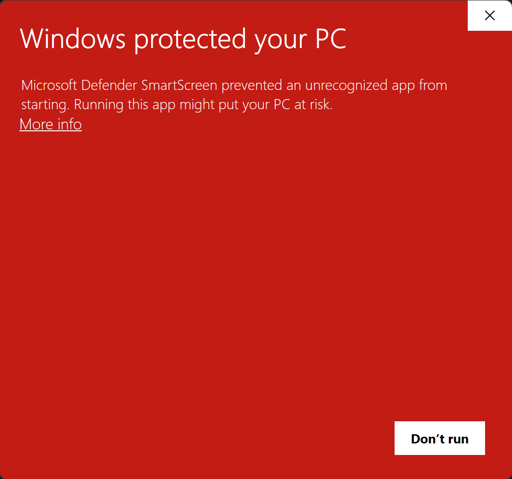
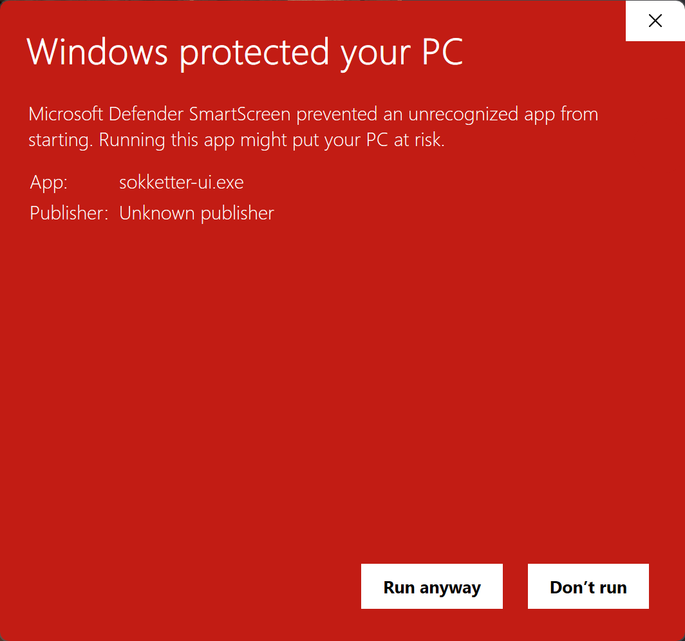
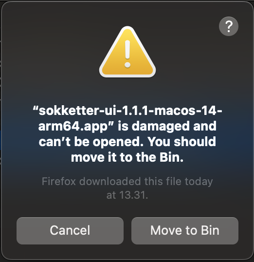
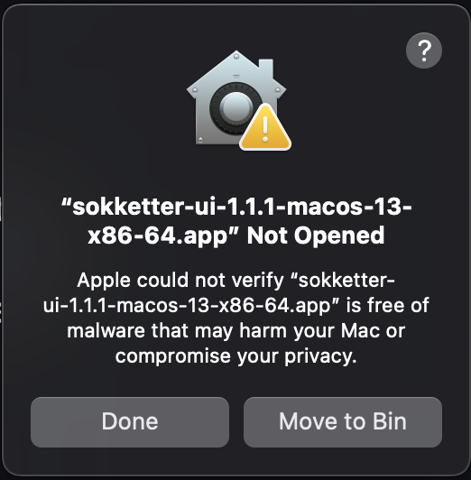
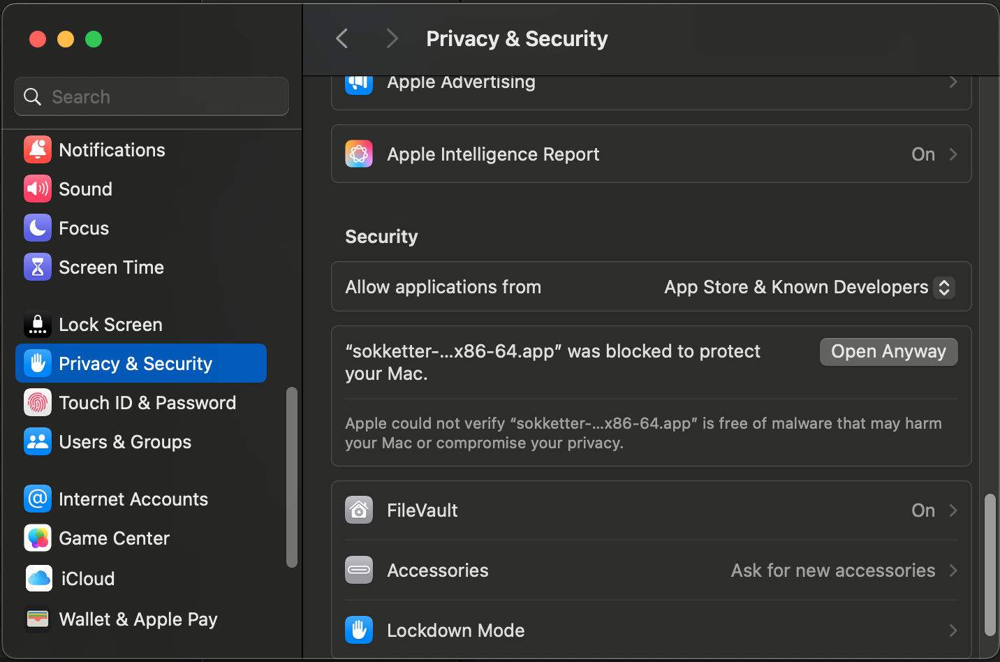
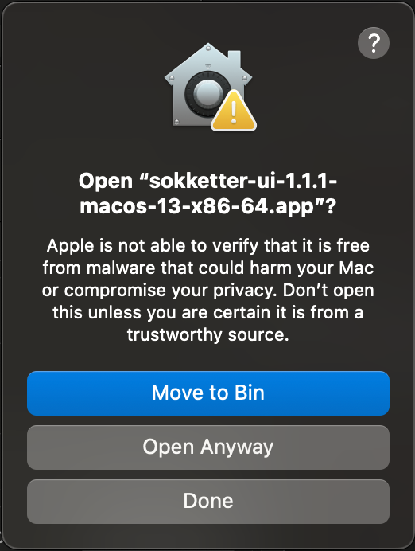

# sokketter

## Description

**sokketter** is a set of CLI and UI applications and the library built with C++17 and Qt that provides a simple and easy-to-use way of controlling the connected sockets. The **libsokketter** library provides a high-level interface for socket programming, making it easier to work with sockets in C++. The set is designed to be cross-platform and works on multiple operating systems.

## Supported platforms

* Windows 10 & 11
* MacOS 10.15 and later
* Ubuntu 20.04 and later

## Supported devices

* Energenie EG-PM
* Energenie EG-PM2
* Energenie EG-PMS
* Energenie EG-PMS2
* Gembird MSIS-PM (not tested)
* Gembird SIS-PM (not tested)

## Security considerations

The library and binaries are not digitally signed at the moment due to a high cost of signing certificates (approximately 100€ per year for MacOS and 500€ per 3 years for Windows). Thus, first time you run the application, it will ask you to approve the application.

### Windows

Any operations with Gembird / Energenie devices on Windows 11 may be drastically slowed down in case when no original driver is installed.
The original driver is available on the [Energenie website](https://energenie.com/item.aspx?id=7415).

During the first run, Windows will say that the application is not recognized and may be not safe. If you trust the application built by a random stranger on the Internet, then click on "More info" and then "Run anyway".

<p align="center">
 
</p>

### MacOS

#### M1 (ARM64)

All downloaded and not signed or notarized ARM64 applications are put into quarantine and require additional steps to run. Running the application for the first time will show a warning that the application is damaged and can't be opened. This is a security feature of MacOS that prevents running untrusted applications.

<p align="center">

</p>

To run the application, you need to open the terminal and run the following command:

```bash
xattr -c APPLICATION_DOWNLOAD_PATH
```

#### Intel (x86_64)

All downloaded and not signed or notarized x86_64 applications are blocked by default and require additional steps to run. Running the application for the first time will show a warning that the application is not verified and can't be opened.

<p align="center">

</p>

To run the application, you need to proceed to the "System Preferences" -> "Security & Privacy" and click on "Open Anyway" button.

<p align="center">

</p>

It will require you to confirm that you want to run the application. Click on "Open Anyway" button.

<p align="center">

</p>

And then enter the local user credentials. After that, you can run the application.

### Ubuntu / Debian

To run the application, you need to make it executable by running the following command:

```bash
chmod +x APPLICATION_DOWNLOAD_PATH
```

## Credits

* [cli11](https://github.com/CLIUtils/CLI11) - used as source code, non-modified, originally distributed under its own license.
* [googletest](https://github.com/google/googletest) - used as source code, non-modified, originally distributed under BSD-3-Clause license.
* [kommpot](https://github.com/morwy/kommpot) - used as source code, non-modified, originally distributed under BSD-3-Clause license.
* [spdlog](https://github.com/gabime/spdlog) - used as source code, non-modified, originally distributed under MIT license.
* [Elise Navennec - function export implementation](https://atomheartother.github.io/c++/2018/07/12/CPPDynLib.html) - used as source code, non-modified, originally distributed under MIT license.
