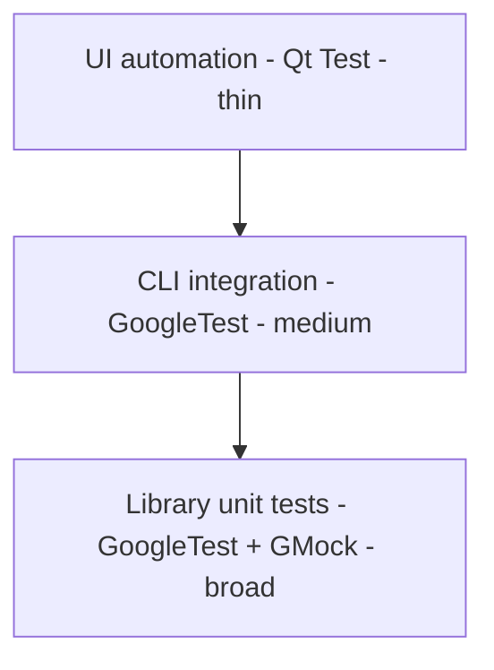

# sokketter Testing Plan

This document defines how to verify **sokketter** before a release. It has two parts:

- **[Part 1 — Manual Test Plan](#part-1--manual-test-plan)** — a pre-release checklist covering every
  user-facing feature of the three first-party components (`libsokketter`, `sokketter-cli`,
  `sokketter-ui`) on Windows, Linux, and macOS.
- **[Part 2 — Automated Test Plan](#part-2--automated-test-plan)** — a testing strategy derived from
  the manual plan, with concrete tooling recommendations and a prioritized roadmap.

The scope is the current functionality only. Supported devices, platforms, and the public API are
described in [README.md](README.md) and [AGENTS.md](AGENTS.md).

---

## Components under test

| Component | Description | Key sources |
| --- | --- | --- |
| `libsokketter` | Core C++17 library. Public API only. | [libsokketter/include/libsokketter.h](libsokketter/include/libsokketter.h) |
| `sokketter-cli` | CLI11 command-line front end. | [sokketter-cli/sources/cli_parser.cpp](sokketter-cli/sources/cli_parser.cpp) |
| `sokketter-ui` | Qt6 Widgets GUI. | [sokketter-ui/sources/mainwindow.cpp](sokketter-ui/sources/mainwindow.cpp) |

### Supported devices

| Device | Bus | VID:PID / identity | Sockets | Auth |
| --- | --- | --- | --- | --- |
| Gembird MSIS-PM | USB | `0x04b4:0xfd10` | 1 | none |
| Gembird MSIS-PM2 | USB | `0x04b4:0xfd12` | 1 | none |
| Gembird SIS-PM | USB | `0x04b4:0xfd11` | 4 | none |
| Energenie EG-PMS | USB | `0x04b4:0xfd13` | 4 | none |
| Energenie EG-PMS2 | USB | `0x04b4:0xfd15` | 4 | none |
| Energenie EG-PMxx-LAN | Ethernet | TCP port `5000`, MAC `88:B6:27:*` | 4 | password |
| Test Device | fake | env-var driven | 4 | none |

---

## Test environment setup

### Build

Build each library flavor explicitly; `IS_COMPILING_STATIC` / `IS_COMPILING_SHARED` must be set.

```powershell
# Static library flavor
cmake -B build -DIS_COMPILING_STATIC=true -DIS_COMPILING_SHARED=false
cmake --build build --config Debug

# Shared library flavor
cmake -B build-shared -DIS_COMPILING_STATIC=false -DIS_COMPILING_SHARED=true
cmake --build build-shared --config Debug
```

To build the automated tests, add `-DSOKKETTER_ENABLE_TESTING=true` and run them with
`ctest --test-dir build --output-on-failure`.

### Fake devices (no hardware required)

Set `LIBSOKKETTER_TEST_DEVICE_NUMBER` to the desired count to make `sokketter::devices()` return that
many `Test Device` instances (4 sockets each). This drives the CLI and UI without hardware.

```powershell
$env:LIBSOKKETTER_TEST_DEVICE_NUMBER = "2"   # enable
Remove-Item Env:\LIBSOKKETTER_TEST_DEVICE_NUMBER  # disable
```

### Storage / state locations

Persisted state must be inspected and reset between cases. Delete these files to start clean.

| Platform | Storage path | Files |
| --- | --- | --- |
| Windows | `C:\ProgramData\sokketter` | `devices.json`, `sokketter-ui.json`, `logs\` |
| macOS | `/Users/Shared/sokketter` | `devices.json`, `sokketter-ui.json`, `logs/` |
| Linux | `~/.local/share/sokketter` | `devices.json`, `sokketter-ui.json`, `logs/` |

### Linux USB permissions

USB device access on Linux requires the udev rules in [udev-rules/](udev-rules); install them with
[udev-rules/install-udev-rules.sh](udev-rules/install-udev-rules.sh) and replug the device before
running USB cases.

### Result legend

Each execution table has one result column per supported OS/architecture: **Result: Windows x86_64**
(Windows 10/11), **Result: Linux x86_64** (Ubuntu 20.04+), **Result: macOS arm64** (macOS 10.15+ Apple
Silicon), and **Result: macOS x86_64** (macOS 10.15+ Intel). Fill each cell with one of: ✅ Pass · ❌ Fail · ⚠️ Blocked/NA · ⬜ Not run. Note
the build flavor (static/shared) and app version (`--version` / About page) with the run. Mark a cell
⚠️ when a case does not apply to that platform (e.g. Windows-only title-bar theming).

---

# Part 1 — Manual Test Plan

Test-case IDs are prefixed `MAN-`. Unless a case is device-specific (group E) or hardware-only, run it
with fake devices on each supported OS/architecture and record the outcome in the matching result column.

## A. Build, packaging & smoke

| ID | Steps | Expected | Result: Windows x86_64 | Result: Linux x86_64 | Result: macOS arm64 | Result: macOS x86_64 |
| --- | --- | --- | --- | --- | --- | --- |
| MAN-BUILD-01 | Configure + build the **static** flavor. | Configure and build succeed with no errors. | ⬜ | ⬜ | ⬜ | ⬜ |
| MAN-BUILD-02 | Build with `-DSOKKETTER_ENABLE_TESTING=true`, run `ctest --test-dir build --output-on-failure`. | All discovered tests pass. | ⬜ | ⬜ | ⬜ | ⬜ |
| MAN-BUILD-03 | Launch `sokketter-cli --version` and `sokketter-ui` About page. | Both report the same version and git hash. | ⬜ | ⬜ | ⬜ | ⬜ |
| MAN-BUILD-04 | First run on a clean machine (no storage folder). | Storage + `logs` folders are created; no crash. | ⬜ | ⬜ | ⬜ | ⬜ |

## B. Library API (`libsokketter`)

Exercised through the CLI/UI with fake devices. Optionally re-enable
[libsokketter-test-app](libsokketter-test-app) (currently commented out in
[CMakeLists.txt](CMakeLists.txt)) as a direct API harness.

| ID | Area | Steps | Expected | Result: Windows x86_64 | Result: Linux x86_64 | Result: macOS arm64 | Result: macOS x86_64 |
| --- | --- | --- | --- | --- | --- | --- | --- |
| MAN-LIB-01 | init/deinit | Start then stop any front end. | `initialize()`/`deinitialize()` succeed; logging session opens and closes. | ⬜ | ⬜ | ⬜ | ⬜ |
| MAN-LIB-02 | `devices()` | Enumerate with 0, 1, and N fake devices. | Returned list size matches the env var; names/serials indexed. | ⬜ | ⬜ | ⬜ | ⬜ |
| MAN-LIB-03 | `device(index)` | Request valid and out-of-range indices. | Valid returns a device; out-of-range returns `nullptr` without crash. | ⬜ | ⬜ | ⬜ | ⬜ |
| MAN-LIB-04 | `device(serial)` | Request an existing and a non-existent serial. | Existing returns the device; missing returns `nullptr` and logs a warning. | ⬜ | ⬜ | ⬜ | ⬜ |
| MAN-LIB-05 | `socket` power | Power a socket on, off, and `toggle()`; read `is_powered_on()`. | State transitions and `to_string()` reflect the requested state. | ⬜ | ⬜ | ⬜ | ⬜ |
| MAN-LIB-06 | `forget_device()` | Forget a saved device. | Device removed from `devices.json` and the enumerated list. | ⬜ | ⬜ | ⬜ | ⬜ |
| MAN-LIB-07 | logging | Set each `logging_level` and a logging callback via `set_settings()`. | Callback receives messages at/above the level; `OFF` silences output. | ⬜ | ⬜ | ⬜ | ⬜ |
| MAN-LIB-08 | paths | Call `storage_path()` / `logs_path()`. | Return the documented per-OS locations. | ⬜ | ⬜ | ⬜ | ⬜ |

## C. Command-line interface (`sokketter-cli`)

Enable fake devices (`LIBSOKKETTER_TEST_DEVICE_NUMBER`) except where noted. Verify both `stdout`/`stderr`
content and the process exit code.

| ID | Command | Expected | Result: Windows x86_64 | Result: Linux x86_64 | Result: macOS arm64 | Result: macOS x86_64 |
| --- | --- | --- | --- | --- | --- | --- |
| MAN-CLI-01 | `sokketter-cli` (no args) | Exit `106`; stderr `A subcommand is required`. | ⬜ | ⬜ | ⬜ | ⬜ |
| MAN-CLI-02 | `sokketter-cli --help` / `-h` | Exit `0`; prints the descriptive help text. | ⬜ | ⬜ | ⬜ | ⬜ |
| MAN-CLI-03 | `sokketter-cli --version` / `-v` | Exit `0`; prints `sokketter-cli version …`. | ⬜ | ⬜ | ⬜ | ⬜ |
| MAN-CLI-04 | `sokketter-cli list` (no devices) | Exit `1`; stderr `No devices found.`. | ⬜ | ⬜ | ⬜ | ⬜ |
| MAN-CLI-05 | `sokketter-cli list` (N fake devices) | Exit `0`; numbered device list printed. | ⬜ | ⬜ | ⬜ | ⬜ |
| MAN-CLI-06 | `sokketter-cli list power` / `power list` | Exit `109`; stderr `The following argument was not expected: …`. | ⬜ | ⬜ | ⬜ | ⬜ |
| MAN-CLI-07 | `power status -i 0 -s 1` | Exit `0`; prints device + `Socket 1: … status: off`. | ⬜ | ⬜ | ⬜ | ⬜ |
| MAN-CLI-08 | `power status -n <serial> -s 1` | Exit `0`; same output selected by serial. | ⬜ | ⬜ | ⬜ | ⬜ |
| MAN-CLI-09 | `power status -i 0 -n <serial>` | Exit `108`; stderr `--device-at-index excludes --device-with-serial`. | ⬜ | ⬜ | ⬜ | ⬜ |
| MAN-CLI-10 | `power status` (no device flag) | Exit `1`; stderr `[Option Group: …] is required.`. | ⬜ | ⬜ | ⬜ | ⬜ |
| MAN-CLI-11 | `power status -n <missing>` | Exit `1`; stderr `No device was found.`. | ⬜ | ⬜ | ⬜ | ⬜ |
| MAN-CLI-12 | `power on -i 0` (no `--sockets`) | Exit `0`; **all** sockets report `turned on.`. | ⬜ | ⬜ | ⬜ | ⬜ |
| MAN-CLI-13 | `power on -i 0 -s 1` | Exit `0`; only socket 1 reports `turned on.`. | ⬜ | ⬜ | ⬜ | ⬜ |
| MAN-CLI-14 | `power off -i 0 -s 1 2` | Exit `0`; sockets 1 and 2 report `turned off.`. | ⬜ | ⬜ | ⬜ | ⬜ |
| MAN-CLI-15 | `power toggle -i 0 -s 1` twice | Exit `0`; socket returns to its original state after two toggles. | ⬜ | ⬜ | ⬜ | ⬜ |
| MAN-CLI-16 | `power status -i 0 -s 0` and `-s 99` | Exit `1`; stderr `Socket index … is out of range.` (1-based indices). | ⬜ | ⬜ | ⬜ | ⬜ |
| MAN-CLI-17 | `power on --help` (and status/off/toggle) | Exit `0`; help text shown (help precedence over subcommand). | ⬜ | ⬜ | ⬜ | ⬜ |
| MAN-CLI-18 | Windows-style `/help`, mixed case `LIST`, underscores | Parsed the same as canonical forms (`ignore_case` / `ignore_underscore` / windows options). | ⬜ | ⬜ | ⬜ | ⬜ |

## D. Graphical interface (`sokketter-ui`)

Run with fake devices unless a case is hardware-specific.

### D1. Device list & navigation

| ID | Steps | Expected | Result: Windows x86_64 | Result: Linux x86_64 | Result: macOS arm64 | Result: macOS x86_64 |
| --- | --- | --- | --- | --- | --- | --- |
| MAN-UI-01 | Launch the app. | Main window opens at the persisted geometry; device list populates. | ⬜ | ⬜ | ⬜ | ⬜ |
| MAN-UI-02 | With no devices present. | The empty-list placeholder item is shown; clicking it does nothing. | ⬜ | ⬜ | ⬜ | ⬜ |
| MAN-UI-03 | Click the refresh control. | Device list re-enumerates. | ⬜ | ⬜ | ⬜ | ⬜ |
| MAN-UI-04 | Resize the window. | List items reflow to the available width without clipping. | ⬜ | ⬜ | ⬜ | ⬜ |
| MAN-UI-05 | Toggle **USB devices** / **Ethernet devices** filters in Settings. | List updates to include only the allowed bus types. | ⬜ | ⬜ | ⬜ | ⬜ |
| MAN-UI-06 | Observe a disconnected saved device. | Item shows disconnected state and is not interactive for switching. | ⬜ | ⬜ | ⬜ | ⬜ |

### D2. Authentication

| ID | Steps | Expected | Result: Windows x86_64 | Result: Linux x86_64 | Result: macOS arm64 | Result: macOS x86_64 |
| --- | --- | --- | --- | --- | --- | --- |
| MAN-UI-07 | Click a device with **no** auth (USB/fake). | Goes straight to the socket list. | ⬜ | ⬜ | ⬜ | ⬜ |
| MAN-UI-08 | Click an EG-PMxx-LAN device (password auth). | Redirected to the password page. | ⬜ | ⬜ | ⬜ | ⬜ |
| MAN-UI-09 | Enter the correct password and log in (button or Enter). | `Authentication succeed!`; socket list opens; password saved. | ⬜ | ⬜ | ⬜ | ⬜ |
| MAN-UI-10 | Enter a wrong password. | `Authentication failed! Please try again.`; stays on the page. | ⬜ | ⬜ | ⬜ | ⬜ |
| MAN-UI-11 | Reconnect a device whose saved password no longer works. | Auto-redirect back to the authentication page. | ⬜ | ⬜ | ⬜ | ⬜ |
| MAN-UI-12 | Use the back control on the auth page. | Returns to the device list. | ⬜ | ⬜ | ⬜ | ⬜ |
| MAN-UI-32 | Click a **connected** device with no auth or valid saved credentials. | `try_authenticate()` runs on the worker thread; on success the socket list opens. | ⬜ | ⬜ | ⬜ | ⬜ |
| MAN-UI-33 | Click a saved but **offline/disconnected** device (no auth or valid saved credentials). | Skips authentication and proceeds straight to the socket list; no connection attempt is forced. | ⬜ | ⬜ | ⬜ | ⬜ |
| MAN-UI-34 | On an **offline** device's socket list, open the edit → Configure page, change device/socket fields, and Save. | Sockets are disabled (cannot toggle while offline), but configuration is still editable and persists. | ⬜ | ⬜ | ⬜ | ⬜ |
| MAN-UI-35 | Click a **connected** device whose saved credentials no longer work. | `try_authenticate()` fails and the app redirects to the authentication page. | ⬜ | ⬜ | ⬜ | ⬜ |

### D3. Socket control

| ID | Steps | Expected | Result: Windows x86_64 | Result: Linux x86_64 | Result: macOS arm64 | Result: macOS x86_64 |
| --- | --- | --- | --- | --- | --- | --- |
| MAN-UI-13 | In **single-click** mode, click a socket. | Socket toggles; status LED updates after the async operation. | ⬜ | ⬜ | ⬜ | ⬜ |
| MAN-UI-14 | Switch to **double-click** mode in Settings, single-click a socket. | Single click does nothing; double click toggles. | ⬜ | ⬜ | ⬜ | ⬜ |
| MAN-UI-15 | For a socket with a configurable reset, press reset. | Socket powers off, waits the configured ms, powers back on; button disabled during reset. | ⬜ | ⬜ | ⬜ | ⬜ |
| MAN-UI-16 | Socket with reset = 0 ms. | Reset button is hidden. | ⬜ | ⬜ | ⬜ | ⬜ |
| MAN-UI-17 | Rapidly toggle multiple sockets. | UI stays responsive (I/O on worker thread); no stuck/disabled sockets. | ⬜ | ⬜ | ⬜ | ⬜ |

### D4. Configuration

| ID | Steps | Expected | Result: Windows x86_64 | Result: Linux x86_64 | Result: macOS arm64 | Result: macOS x86_64 |
| --- | --- | --- | --- | --- | --- | --- |
| MAN-UI-18 | Open the socket list edit → Configure page. | Device edit form + one form per socket are shown. | ⬜ | ⬜ | ⬜ | ⬜ |
| MAN-UI-19 | Change device name/description and Save. | New values persist and appear in the device/socket lists after restart. | ⬜ | ⬜ | ⬜ | ⬜ |
| MAN-UI-20 | Change socket name/description and Save. | New values persist. | ⬜ | ⬜ | ⬜ | ⬜ |
| MAN-UI-21 | Set a socket configurable-reset value (validated integer). | Only non-negative integers accepted; reset button appears when > 0. | ⬜ | ⬜ | ⬜ | ⬜ |
| MAN-UI-22 | Delete/forget the device, confirm the warning dialog with **Yes**. | Device removed from list and `devices.json`; returns to device list. | ⬜ | ⬜ | ⬜ | ⬜ |
| MAN-UI-23 | Delete/forget the device, choose **No**. | Nothing is deleted. | ⬜ | ⬜ | ⬜ | ⬜ |
| MAN-UI-24 | Use Configure/back controls. | Navigation returns without saving. | ⬜ | ⬜ | ⬜ | ⬜ |

### D5. Settings, About & theme

| ID | Steps | Expected | Result: Windows x86_64 | Result: Linux x86_64 | Result: macOS arm64 | Result: macOS x86_64 |
| --- | --- | --- | --- | --- | --- | --- |
| MAN-UI-25 | Open Settings; click "open data folder". | Storage folder opens in the OS file manager. | ⬜ | ⬜ | ⬜ | ⬜ |
| MAN-UI-26 | Change socket-toggle radio (single/double). | Saved immediately; socket list click behavior updates. | ⬜ | ⬜ | ⬜ | ⬜ |
| MAN-UI-27 | Change theme radio (Auto/Light/Dark). | Whole app (incl. dialogs, list items) restyles live. | ⬜ | ⬜ | ⬜ | ⬜ |
| MAN-UI-28 | With theme = Auto, change the OS light/dark mode. | App follows the OS theme; Windows title bar switches; macOS detection fires. | ⬜ | ⬜ | ⬜ | ⬜ |
| MAN-UI-29 | Open About. | Shows version, git hash, build date, license line, and components list. | ⬜ | ⬜ | ⬜ | ⬜ |
| MAN-UI-30 | Open the License dialog; switch tabs. | Dialog opens, tabs render, OK closes it; respects the current theme. | ⬜ | ⬜ | ⬜ | ⬜ |
| MAN-UI-31 | Move/resize the window, close, relaunch. | Geometry restored from `sokketter-ui.json`. | ⬜ | ⬜ | ⬜ | ⬜ |

## E. Device-specific (hardware)

Run per attached device. Verify the device is matched to the correct class and that physical switching
works. Confirm the **socket count** matches the table above.

| ID | Device | Steps | Expected | Result: Windows x86_64 | Result: Linux x86_64 | Result: macOS arm64 | Result: macOS x86_64 |
| --- | --- | --- | --- | --- | --- | --- | --- |
| MAN-DEV-01 | Gembird SIS-PM | Plug in; `list`; toggle each of 4 sockets. | Detected as `Gembird SIS-PM`; 4 sockets switch physically; status reads back. | ⬜ | ⬜ | ⬜ | ⬜ |
| MAN-DEV-02 | Gembird MSIS-PM | Plug in; toggle the single socket. | Detected as `Gembird MSIS-PM`; 1 socket switches. | ⬜ | ⬜ | ⬜ | ⬜ |
| MAN-DEV-03 | Gembird MSIS-PM (2) | Plug in; toggle the single socket. | Detected as `Gembird MSIS-PM (2)`; 1 socket switches. | ⬜ | ⬜ | ⬜ | ⬜ |
| MAN-DEV-04 | Energenie EG-PMS | Plug in; toggle each of 4 sockets. | Detected as `Energenie EG-PMS`; serial read from device; 4 sockets switch. | ⬜ | ⬜ | ⬜ | ⬜ |
| MAN-DEV-05 | Energenie EG-PMS2 | Plug in; toggle each of 4 sockets. | Detected as `Energenie EG-PMS2`; 4 sockets switch. | ⬜ | ⬜ | ⬜ | ⬜ |
| MAN-DEV-06 | EG-PMxx-LAN | Discover on LAN; authenticate; toggle each of 4 sockets; read status. | Detected via MAC/port; password login works; 4 sockets switch; status echoed back. | ⬜ | ⬜ | ⬜ | ⬜ |
| MAN-DEV-07 | Any USB | Unplug the device mid-session. | Device shown as disconnected; operations fail gracefully; no crash. | ⬜ | ⬜ | ⬜ | ⬜ |
| MAN-DEV-08 | Linux, any USB | Run without udev rules, then with them. | Without rules: access denied/enumeration fails; with rules: works. | ⚠️ | ⬜ | ⚠️ | ⚠️ |

## F. Persistence & migration

| ID | Steps | Expected | Result: Windows x86_64 | Result: Linux x86_64 | Result: macOS arm64 | Result: macOS x86_64 |
| --- | --- | --- | --- | --- | --- | --- |
| MAN-PER-01 | Connect a new device, then inspect `devices.json`. | Device appended with type/id/name/description/auth/sockets. | ⬜ | ⬜ | ⬜ | ⬜ |
| MAN-PER-02 | Edit config, restart the app. | Edited values survive the restart. | ⬜ | ⬜ | ⬜ | ⬜ |
| MAN-PER-03 | Enumerate with fake devices, inspect `devices.json`. | Test devices are **not** persisted. | ⬜ | ⬜ | ⬜ | ⬜ |
| MAN-PER-04 | Load an old `devices.json` with no `authentication-type`. | Loads without error; auth type defaults from the device class (backwards compatible). | ⬜ | ⬜ | ⬜ | ⬜ |
| MAN-PER-05 | Corrupt/partial `devices.json`. | App logs an error and starts with a usable (empty) database instead of crashing. | ⬜ | ⬜ | ⬜ | ⬜ |
| MAN-PER-06 | Change UI settings, inspect `sokketter-ui.json`. | Window geometry, socket-toggle, theme, and bus filters are persisted. | ⬜ | ⬜ | ⬜ | ⬜ |

## G. Logging & robustness

| ID | Steps | Expected | Result: Windows x86_64 | Result: Linux x86_64 | Result: macOS arm64 | Result: macOS x86_64 |
| --- | --- | --- | --- | --- | --- | --- |
| MAN-LOG-01 | Run any component and inspect the `logs` folder. | A daily log file is written; no secrets (e.g. passwords) are logged. | ⬜ | ⬜ | ⬜ | ⬜ |
| MAN-LOG-02 | Trigger error paths (missing device, bad index). | Errors are logged at the appropriate level with useful context. | ⬜ | ⬜ | ⬜ | ⬜ |
| MAN-ROB-01 | Leave the UI idle, then refresh repeatedly. | No leaks/hangs; enumeration completes each time. | ⬜ | ⬜ | ⬜ | ⬜ |

---

# Part 2 — Automated Test Plan

The automated suite mirrors the manual plan as a testing pyramid: a broad base of fast library unit
tests, a middle layer of CLI integration tests, and a thin top layer of GUI automation. Test-case IDs
are prefixed `AUTO-`.



## Current state

| Suite | Location | Status |
| --- | --- | --- |
| CLI parser tests | [sokketter-cli/tests](sokketter-cli/tests) | Present — options, subcommands, general parsing. |
| Library unit tests | — | **Missing** — factory, storage, device logic untested. |
| UI tests | — | **Missing**. |
| kommpot tests | [third-party/kommpot/tests](third-party/kommpot/tests) | Vendored; do not edit. |

## Recommended tooling

| Layer | Tool | Rationale |
| --- | --- | --- |
| Library / CLI unit + integration | **GoogleTest + GMock** | Already fetched (v1.16.0) and wired via `gtest_discover_tests`; matches existing CLI tests. |
| Hardware seam | **GMock double for `kommpot::device_communication`** | The communication layer is an abstract interface — mock it to test device classes without hardware. |
| Fake devices (integration) | **`LIBSOKKETTER_TEST_DEVICE_NUMBER`** | Existing in-process fake path; no hardware needed. |
| GUI (widget-level) | **Qt Test (`QtTest`)** | Free, ships with Qt6; `QTest::mouseClick`, `QSignalSpy`, and event injection cover the widgets. |
| GUI (optional end-to-end) | **Squish for Qt** | Commercial; only if scripted full-app E2E is required beyond Qt Test. |
| Coverage | **lcov/gcov** (Linux/macOS), **OpenCppCoverage** (Windows) | `get_coverage.sh` already uses lcov; OpenCppCoverage fills the Windows gap. |
| Memory / UB | **ASan + UBSan** (Clang/GCC) | Catch leaks and UB in device/serialization code on Linux/macOS. |
| Static analysis | **clang-tidy + cppcheck** | Enforce the project C++ conventions and catch defects pre-merge. |
| CI orchestration | **GitHub Actions** via [Build.py](Build.py) | Existing pipeline; extend with a test matrix across the three platforms. |

## L1 — Library unit tests (new `libsokketter/tests` target)

Add a GoogleTest target discovered with `gtest_discover_tests` (label `unit`), linking the library and
mocking `kommpot::device_communication`.

| ID | Under test | Derived from | Notes |
| --- | --- | --- | --- |
| AUTO-LIB-01 | `power_strip_factory::create` by USB VID/PID | MAN-DEV-01..05 | Feed mock identifications; assert the correct concrete class and socket count. |
| AUTO-LIB-02 | `power_strip_factory::create` by Ethernet identity | MAN-DEV-06 | Match on port/MAC; assert `energenie_eg_pmxx_lan`. |
| AUTO-LIB-03 | `power_strip_factory::supported_devices(filter)` | MAN-UI-05 | Filter by USB/Ethernet/ALL and assert the identification set. |
| AUTO-LIB-04 | `energenie_eg_base` power/status control-transfer bytes | MAN-DEV-04 | Assert exact `request_type/request/value` + buffer via the mock. |
| AUTO-LIB-05 | `database_storage` JSON round-trip | MAN-PER-01/02 | Serialize → deserialize a device; fields and sockets survive. |
| AUTO-LIB-06 | Enum (de)serialization | MAN-PER-04 | `power_strip_type` / `authentication_type` map to expected strings; unknowns handled. |
| AUTO-LIB-07 | Test devices skipped on save | MAN-PER-03 | `to_json` omits `TEST_DEVICE`. |
| AUTO-LIB-08 | Backwards-compatible auth default | MAN-PER-04 | `copyFrom` keeps class default when saved type is `UNKNOWN`. |
| AUTO-LIB-09 | `socket` power/toggle/status callbacks | MAN-LIB-05 | Guard against missing callbacks; `toggle()` inverts state. |
| AUTO-LIB-10 | `power_strip::to_string` / `socket::to_string` | MAN-CLI-05/07 | Exact formatting used by the CLI. |
| AUTO-LIB-11 | `version_information::to_string` | MAN-BUILD-04 | `major.minor.micro.nano` format. |
| AUTO-LIB-12 | `authentication::is_valid` | MAN-UI-09/10 | NONE valid; PASSWORD_ONLY valid iff non-empty; UNKNOWN invalid. |
| AUTO-LIB-13 | `device(index)` / `device(serial)` bounds | MAN-LIB-03/04 | Out-of-range and missing serial return `nullptr`. |
| AUTO-LIB-14 | Logging level / callback routing | MAN-LIB-07 | Callback fires at/above level; `OFF` silences. |

## L2 — CLI integration tests (extend `sokketter-cli/tests`)

Extend the existing suite (using `LIBSOKKETTER_TEST_DEVICE_NUMBER`) to close gaps.

| ID | Under test | Derived from | Notes |
| --- | --- | --- | --- |
| AUTO-CLI-01 | `power on/off/toggle` on all sockets | MAN-CLI-12 | Assert per-socket stdout lines and exit `0`. |
| AUTO-CLI-02 | `power` on specific + multiple sockets | MAN-CLI-13/14 | `-s 1`, `-s 1 2`. |
| AUTO-CLI-03 | `toggle` idempotency | MAN-CLI-15 | Two toggles restore state. |
| AUTO-CLI-04 | Socket index out of range (`0`, too large) | MAN-CLI-16 | Exit `1`, correct message, 1-based indexing. |
| AUTO-CLI-05 | Case/underscore/windows-style options | MAN-CLI-18 | Canonical parsing. |
| AUTO-CLI-06 | Help precedence across subcommands | MAN-CLI-17 | Regression for the manual help-forwarding workaround. |
| AUTO-CLI-07 | **Env-var contract regression** | see note below | Pin the fake-device output the CLI tests rely on. |

> **Verify:** the CLI tests set `LIBSOKKETTER_TESTING_ENABLED=1` and expect
> `Test Device (TEST DEVICE, TEST_SERIAL_NUMBER, located at TEST_ADDRESS)`, but the library's fake path
> reads `LIBSOKKETTER_TEST_DEVICE_NUMBER` and produces indexed names (`Test Device 0`,
> `TEST_SERIAL_NUMBER_0`). Reconcile the two env vars/output before relying on `AUTO-CLI-07`; treat any
> mismatch as a defect to fix, not to encode.

## L3 — UI automation (new Qt Test target)

Widget-level tests with `QtTest`, driving fake devices via the env var. Keep them headless-capable
(offscreen platform plugin) for CI.

| ID | Under test | Derived from | Notes |
| --- | --- | --- | --- |
| AUTO-UI-01 | Device list population + empty placeholder | MAN-UI-01/02 | Assert item widgets after enumeration. |
| AUTO-UI-02 | Bus filter behavior | MAN-UI-05 | Toggle checkboxes → `repopulate_device_list`. |
| AUTO-UI-03 | Socket toggle single vs double click | MAN-UI-13/14 | `QTest::mouseClick` / `mouseDClick`; `QSignalSpy` on state change. |
| AUTO-UI-04 | Configurable-reset flow | MAN-UI-15/16 | `toggleResetButton` signal; button hidden at 0 ms. |
| AUTO-UI-05 | `DeviceEditForm` / `SocketEditForm` round-trip | MAN-UI-19/20/21 | Set fields → `configuration()` returns them; integer validator enforced. |
| AUTO-UI-06 | Settings persistence | MAN-UI-26/31 | `app_settings_storage` round-trip for toggle/theme/geometry/filters. |
| AUTO-UI-07 | Theme switch | MAN-UI-27 | Stylesheet changes on `ThemeChange`. |
| AUTO-UI-08 | Auth page routing | MAN-UI-07/08 | No-auth → socket list; password device → auth page. |
| AUTO-UI-09 | Offline-device click routing | MAN-UI-33/35 | Offline saved device → socket list without `try_authenticate()`; connected device with failing auth → auth page. Needs a saved-but-disconnected fixture (fake test devices always report connected). |

## Cross-cutting jobs

| ID | Job | Notes |
| --- | --- | --- |
| AUTO-CC-01 | Coverage gate | lcov (Linux/macOS) + OpenCppCoverage (Windows); publish a report; set a floor and ratchet up. |
| AUTO-CC-02 | Sanitizers | ASan/UBSan build running L1+L2 on Linux/macOS. |
| AUTO-CC-03 | Static analysis | clang-tidy + cppcheck on first-party sources (exclude `third-party/`). |
| AUTO-CC-04 | CI matrix | Windows/Linux/macOS × static/shared; run `ctest`; fix the `SOKKETTER_ENABLE_TESTING` flag in [Build.py](Build.py). |
| AUTO-CC-05 | Hardware-in-the-loop (optional) | Nightly self-hosted runner with real devices covering group E. |

## Prioritized roadmap

1. **P0 — Library unit tests (AUTO-LIB-\*).** Highest value: the core has zero coverage today. Start
   with the factory, `database_storage`, and device control-transfer logic.
2. **P1 — CLI integration gaps (AUTO-CLI-\*)** and resolving the env-var discrepancy (AUTO-CLI-07).
3. **P2 — Qt Test UI suite (AUTO-UI-\*)** for the highest-traffic flows (device list, socket toggle,
   settings/theme, forms).
4. **P3 — Cross-cutting (AUTO-CC-\*):** sanitizers, static analysis, coverage gate, and the CI matrix;
   add hardware-in-the-loop last.
